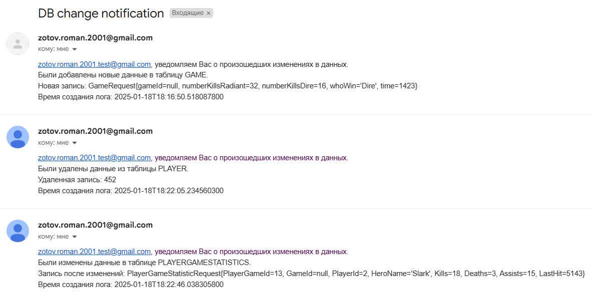
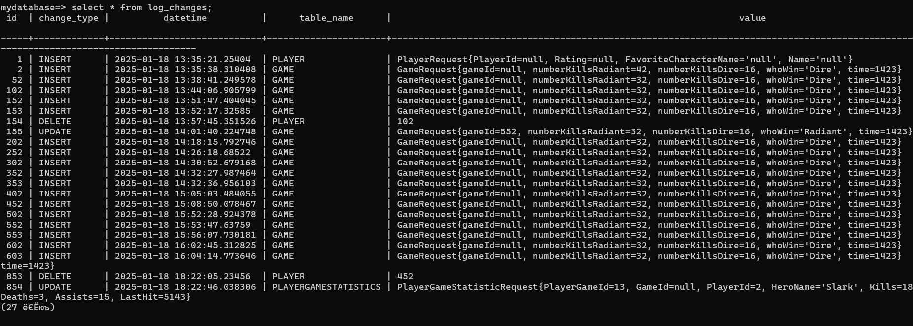

<h1>Лабораторная работа #4. Java Message Service </h1>

<p>Работающая версиия 4 лабораторной</p>

<h2>Задание 1</h2>
<p>Добавлены таблицы: "log_changes" - логи обновлений таблиц "player_profiler","game_profiler","player_game_statistic"; "events_to_subscribe" - список изменений, "subscriptions" - список адресов куда отправляются изменения</p>
<h2>Задание 2</h2>
<p>Для реализации JMS был использован Spring JMS</p>
<p>Для отправки/получения сообщений использовался Apache ActiveMQ</p>
<h2>Задание 3</h2>
<p>Настройка JmsTemplate для отправки сообщений осуществляется в конфигурационном классе SenderConfig. Для интеграции с Spring JMS требуется инициализировать объект ConnectionFactory, который отвечает за установку подключений к JMS. Если используется ActiveMQ, то применяется ActiveMQConnectionFactory. В этот объект передается URL брокера, который загружается из конфигурационного файла application.properties через аннотацию @Value. Для повышения производительности и обеспечения кэширования сессий, подключений и отправителей, а также для автоматического восстановления соединений, используется обертка CachingConnectionFactory.</p>

<h2>Задание 4</h2>
<p>Для передачи данных применялся JmsTemplate, которому необходима ссылка на ConnectionFactory. Чтобы отправить информацию, используется метод convertAndSend(). Этот метод преобразует переданный объект в JMS-сообщение и отправляет его в очередь logger.q.</p>

<h2>Задание 5</h2>
<p>Аннотация @JmsListener инициирует создание контейнера для прослушивания сообщений через JmsListenerContainerFactory. Внутри метода, отвечающего за обработку сообщений, реализована функциональность, связанная с логированием и отслеживанием изменений. Полученное сообщение, имеющее тип Log, сохраняется в базу данных. Далее выполняется проверка, относится ли тип изменения к тем, которые указаны в таблице events_to_subscribe. Если данный тип изменений требует уведомления по электронной почте, то для всех пользователей, подписанных в subscriptions, осуществляется рассылка уведомлений. Текст письма формируется в классе LetterDto с использованием метода toString().</p>

```
@RequiredArgsConstructor
@Component
public class Receiver {
    private final LogRepository logRepository;
    private final SubscriptionRepository subscriptionRepository;
    private final EventToSubscribeRepository eventToSubscribeRepository;
    private final SendEmailService sendEmailService;

    @JmsListener(destination = "logger.q")
    public void receive(Log message) {
        logRepository.save(message);
        //System.out.println("проверка работы");
        //System.out.println(subscriptionRepository.findAll().size());
        List<ChangeTypeEnum> eventToSubscribeList = eventToSubscribeRepository
                .findAll()
                .stream().map(EventToSubscribe::getEventType)
                .toList();

        if (! eventToSubscribeList.contains(message.getChangeType()))
            return;
        List<Subscription> subscriptions = subscriptionRepository.findAll();
        List<LetterDto> letterDtoList = subscriptions
                .stream()
                .map((e) -> new LetterDto(message, e))
                .toList();
        System.out.println(letterDtoList.size());
        letterDtoList.forEach(sendEmailService::sendEmail);
    }
}
```

<h2>Задание 6</h2>
<p>Email sender в Spring Boot — это компонент для отправки писем через SMTP. Настройки сервера (хост, порт, логин, пароль) задаются в application.yml. Spring Boot предоставляет JavaMailSender, который используется для создания и отправки писем. Письмо формируется через SimpleMailMessage или MimeMessage, где указываются тема, текст и получатель. Вызов метода send() отправляет письмо через SMTP-сервер.</p>

```
public void sendEmail(LetterDto letterDto) {
    SimpleMailMessage mailMessage = new SimpleMailMessage();
    mailMessage.setFrom("zotov.roman.2001@gmail.com");
    mailMessage.setTo(letterDto.getSubscription().getEmail());
    mailMessage.setSubject("DB change notification");
    mailMessage.setText(letterDto.toString());
    mailSender.send(mailMessage);
}
```

<h2>Задание 7</h2>

<p>Проверка работоспособности отправки логов на почту</p>



<p>Проверка работоспособности сохранения логов в базе данных</p>

