<h1>Лабораторная работа #1. Application with common JavaEE architecture </h1>
<h2>Задание 1</h2>
<p>Я пытался установить сервер GlassFish, но возникали разные ошибки</p>
<p>Ошибки по типу: java.io.IOException: org.xml.sax.SAXParseExceptionpublicId: file:/D:/ВУЗ/Магистратура/Glassfish/glassfish7/glassfish/lib/schemas/web-app_6_0.xsd; lineNumber: 258; columnNumber: 50; Deployment descriptor file WEB-INF/web.xml in archive [__admingui].  src-resolve: Cannot resolve the name 'jakartaee:web-commonType' to a(n) 'group' component.</p>

<p>Кроме того, пытался установить разные версии (так как есть шанс, что версии java не совместимы: устанавливал GlassFish 5,6,7)</p>
<p>Пытался изменить код, чтобы пофиксить ошибки, но через неделю исправлений, я понял, что лучше использовать другой сервер</p>
<p>Выбор пришелся на Tomcat версии 10.1.31 (более низкие версии несовместимы с jacarta 10)</p>
<p>Для того чтобы запустить этот сервер, нужно просто скачать его с оф.сайта, потом распаковать его в какую-либо папку</p>
<p>Потом WAR файл (сформированный maven) помещаем в папку "/tomcat/webapps/"</p>
<p>Далее в командной строке выполняем </p>
```
.\bin\startup.bat
```
<p>Если все удачно, то в консоли выведет</p>
```
Using CATALINA_BASE:   "D:\ВУЗ\Магистратура\Tomcat\apache-tomcat-10.1.31"
Using CATALINA_HOME:   "D:\ВУЗ\Магистратура\Tomcat\apache-tomcat-10.1.31"
Using CATALINA_TMPDIR: "D:\ВУЗ\Магистратура\Tomcat\apache-tomcat-10.1.31\temp"
Using JRE_HOME:        "C:\Program Files\Java\jdk-18.0.2.1"
Using CLASSPATH:       "D:\ВУЗ\Магистратура\Tomcat\apache-tomcat-10.1.31\bin\bootstrap.jar;D:\ВУЗ\Магистратура\Tomcat\apache-tomcat-10.1.31\bin\tomcat-juli.jar"
Using CATALINA_OPTS:   ""
```
<p>Если хотим выключить сервер, в командной строке выполняем</p>
```
.\bin\shutdown.bat
```
<h2>Задание 2</h2>
<p>Версия базы данных PostreSQL 17</p>
<h2>Задание 3</h2>
<p>Предметная область: статистика игроков, игр и игроков и играх</p>
<p>ссылка на схему таблицы: https://drive.google.com/file/d/1TjCzRy5vULND2vxSL5Vb5Rf46imNQazP/view?usp=sharing</p>
<p>Таблицы в базе данных создаются автоматически при запуске сервера (если их нет), но для того чтобы создавался, нужно создать database и пользователя</p>
```
CREATE DATABASE mydatabase;
\c mydatabase
CREATE SCHEMA public;
CREATE USER myusername WITH PASSWORD 'mypassword';
GRANT ALL PRIVILEGES ON DATABASE mydatabase TO myusername;
GRANT ALL ON SCHEMA public TO myusername;
GRANT ALL PRIVILEGES ON ALL TABLES IN SCHEMA public TO myusername;
GRANT ALL PRIVILEGES ON ALL SEQUENCES IN SCHEMA public TO myusername;
GRANT ALL PRIVILEGES ON ALL FUNCTIONS IN SCHEMA public TO myusername;
```
<h2>Задание 4</h2>
<p>Для создания слоя данных нужно использовать аннотации:</p>
<p>@Entity: указывает, что класс является сущностью и отображается на таблицу в базе данных.</p>
<p>@Table(name = "name_table"): указывает, к какой таблице в базе данных привязана сущность.</p>
<p>@Id: помечает поле как первичный ключ сущности.</p>
<p>@Column: задаёт отображение поля класса на колонку в таблице базы данных. </p>
<p>@ManyToOne: указывает на связь "многие-к-одному" между двумя сущностями.</p>
<p>Классы реализующие слой данных, находятся в com.example.labservlet.entities</p>
<h2>Задание 5</h2>
<p>Классы реализующие слой бизнес логики, находятся в com.example.labservlet.beans</p>
<p>Из основного: EntityManagerFactory создаётся один раз для всего приложения и управляет созданием EntityManager для выполнения операций с базой данных. Параметр "myPersistenceUnit" — это имя, заданное в файле persistence.xml</p>
<p>Бины реализуют CRUD операции</p>
- добавить объект
- считать(найти) объект
- обновить объект
- удалить объект
- +операция поиска всех объектов
<h2>Задание 6</h2>
<p>Уровень представления был реализован при помощи сервлетов + JSP</p>
<p>Сервлеты в com.example.labservlet.services</p>
<p>JSP в .webapp</p>
<p>Существуют следующие типы сервлетов:</p>
<p>PlayerServlet, GameServlet, PlayerGameServlet  — для просмотра содержимого таблицы</p>
<p>Edit*Servlet — для просмотра по одной записи</p>
<p>Update*Servlet — для обновления записи</p>
<p>Remove*Servlet — для удаления записи</p>
<p>Add*Servlet — для добавления записи</p>
<p>Существуют следующие JSP-файлы:</p>
<p>players.jsp, games.jsp, playersGames.jsp - для просмотра содержимого таблицы</p>
<p>editPlayer.jsp, editGame.jsp, editPlayerGame.jsp - для редактирования содержимого записи</p>
<p>addPlayer.jsp, addGame.jsp, addPlayerGame.jsp - для добавления в таблицу</p>
<p>actionSuccess.jsp - для показания успешности операции</p>
<p>menu.jsp - для того, чтобы ссылки отображались сверху</p>
<p>Подробности организации Сервлетов и JSP файлов, можно увидеть в коде этих файлов</p>
<h2>Задание 7</h2>
<p>Показываю что все работает вместе</p>
<p>Начальная страница:</p>

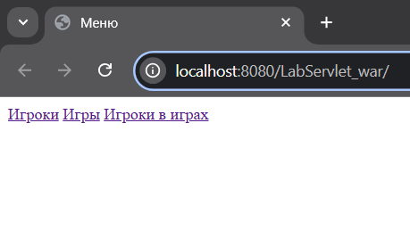

<p>Страницы таблиц:</p>

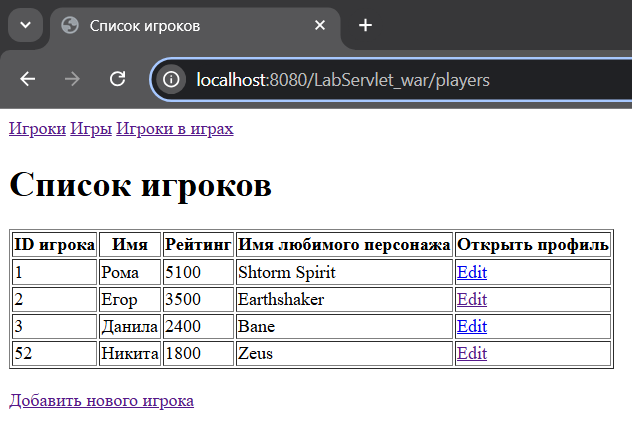
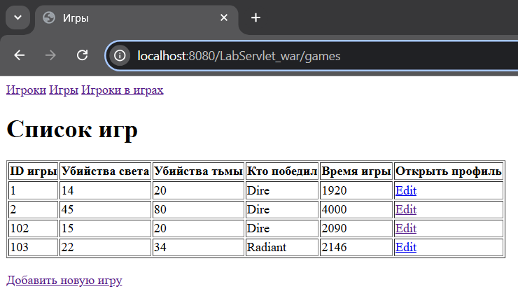
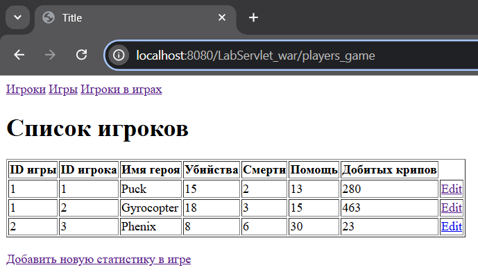

<p>Перейдем в страницы edit:</p>

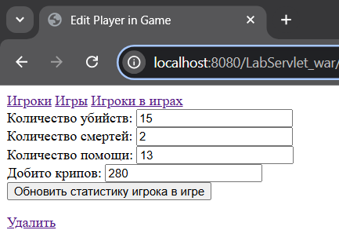
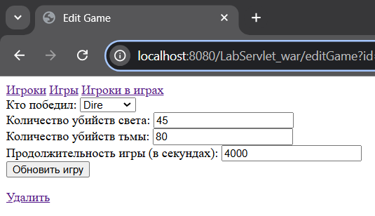
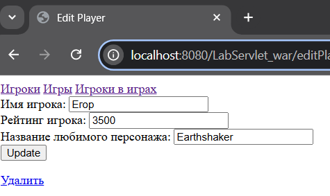

<p>Попробуем произвести удаление и обновление (пробовать буду только в статистики игрока, так как если удалять, то там каскадно удалиться, и удалиться все, а я не хочу):</p>
<p>(вспоминаем первую картинку в прошлом пункте и видим, что я там поменял киллы и lasthit)</p>

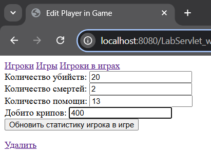

<p>Видим, что обновление успешно:</p>

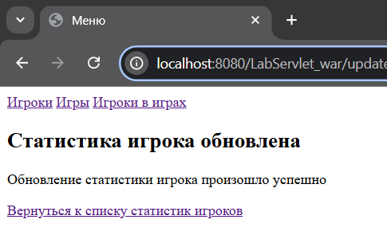

<p>Действительно данные изменились:</p>


<p>Теперь попробуем добавить:</p>

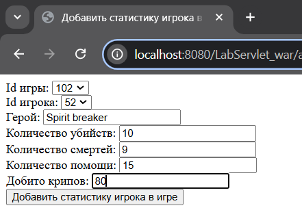

<p>Видим, что добавилось:</p>

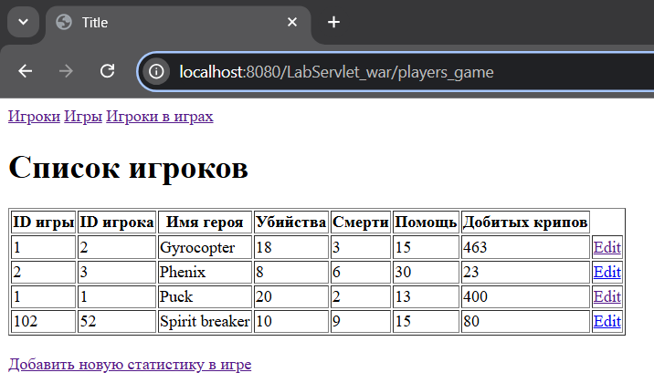

<p>Попробуем удалить:</p>

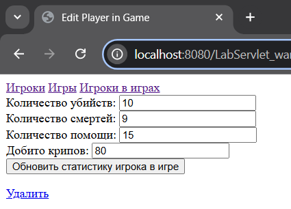
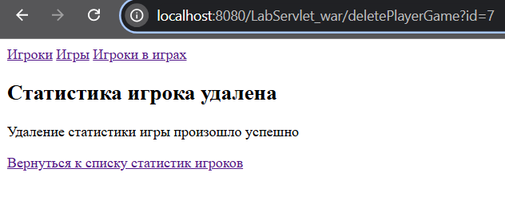

<p>Как видим, запись удалилась:</p>

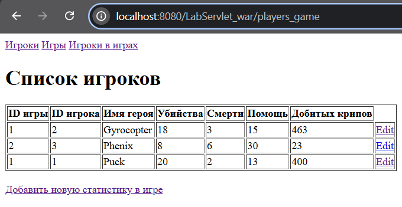