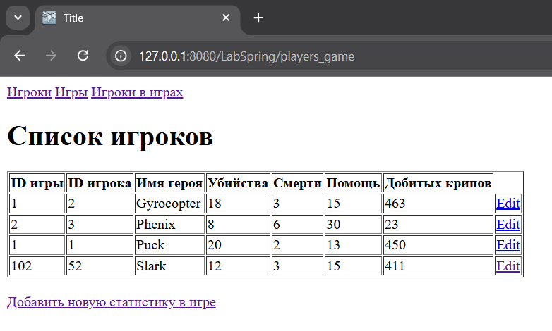

<h1>Лабораторная работа #2. Application using Spring Framework </h1>
<h2>Задание 1</h2>
<p>В лабораторной работе использовалась таже модель и сценарий, что и в первой лабораторнойы</p>
<h2>Задание 2</h2>
<p>Уровень данных такой же, но есть дополнительный файл конфигурации (mvc-config.xml). В нем:</p>

- включение режима, управления аннотациями;
- указание базового пакета для поиска компонентов;
- правила для просмотра файлов;
- определяет компонент EntityManagerFactory;
- определяет TransactionManager.
<h2>Задание 3</h2>
<p>Бизнес логика такая же, но использует аннотации @Service и @Transactional для каждого класса Service.</p>
<h2>Задание 4</h2>
<p>Что касается веб-слоя, то он имеет ту же логику, что и сервлеты ранее, но использование контроллеров позволило содержать логику. Файлы JSP такие же, как и раньше.</p>

<p>Были использованы аннотации:</p>

- @Controller для обозначение контроллера;
- @Autowired для автоматического внедрения (инъекции) зависимостей в компоненты.

```
    @Autowired
    private GameService gameService;

    @Autowired
    private PlayerService playerService;

    @Autowired
    private GamePlayerService gamePlayerService;
```

- @GetMapping для обработки HTTP-запросов метода GET на указанный URL-адрес;
- @RequestParam для получения значения параметра.

<p>Типы возвращаемых данных — строки. У нас есть два конкретных типа возвращаемых данных:</p>

- имя файла JSP, который должен быть отображен;
- перенаправление на другую страницу:

```
    return "redirect:/playersGames";
```

<p>Также использовался объект класса Model в качестве параметра метода для указания атрибутов, которые будут предоставлены файлам JSP:</p>

```
    model.addAttribute("gameList", gameList);
    model.addAttribute("playerList", playerList);
    model.addAttribute("gamePlayerList", gamePlayerList);
```

<h2>Задание 5</h2>
<h3>Демонстрация работы программы</h3>
<p>Начальное меню</p>


<p>Базовые страницы</p>




<p>Добавление, обновление, удаление,  на примере игрока в играх</p>


<p>Можно убедиться, что все функции работают</p>